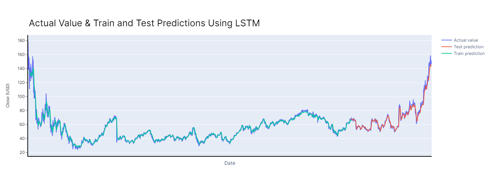
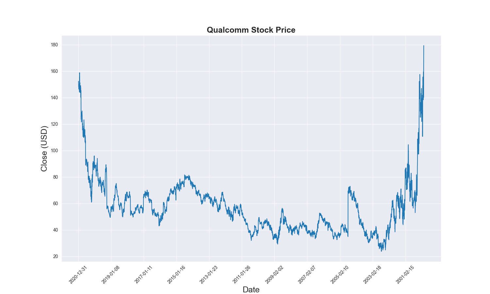

# LSTM Stock Price Predictor

This program trains an LSTM network based on portions of the time series data of a given stock (example present is Qualcomm, [NASDAQ: QCOM](https://www.nasdaq.com/market-activity/stocks/qcom)), and then predicts the price based on the remainder of the stock price data (so predictions can be compared to the actual values).

## What are LSTM networks?

Long short-term memory (LSTM) networks are a type of recurrent neural network (RNN) that are ideal for processing time series data and forecasting predictions. RNNs allow previous outputs to be used as inputs, and can learn long term dependencies to predict future outputs.

### Learn more about LSTM and RNN networks:

* https://en.wikipedia.org/wiki/Long_short-term_memory
* https://en.wikipedia.org/wiki/Recurrent_neural_network

## Epoch Training Data
|Epoch     |MSE (Mean squared error)    |
|----------|--------|
|0         |0.241030395|
|1         |0.1152776778|
|2         |0.04112171754|
|3         |0.1774899215|
|4         |0.0536917299|
|5         |0.04336381704|
|...       |...          |
|95        |0.001312771346|
|96        |0.001303042984|
|97        |0.001304647536|
|98        |0.001301135286|
|99        |0.001289665466|

Training Time: 61.23 s

Train Score: 2.08 RMSE (Root mean squared error)

Test Score: 4.93 RMSE

## Stock Data

|Date      |Low     |High  |Close |Open    |
|----------|--------|------|------|--------|
|2000-01-03|174     |200   |179.3 |199     |
|2000-01-04|160     |175.1 |162.1 |171.8   |
|2000-01-05|139     |163   |158   |159.9   |
|2000-01-06|139.8   |156   |140.1 |148.5   |
|2000-01-07|132.9   |150.5 |150   |134     |
|...       |...     |...   |...   |...     |
|2020-12-24|147.2   |148.9 |148.79|147.8   |
|2020-12-28|147.44  |151.07|147.74|150.62  |
|2020-12-29|147.03  |148.99|148.49|148.97  |
|2020-12-30|148.9227|151.61|149.95|149.12  |
|2020-12-31|150.1   |152.56|152.34|150.3218|

